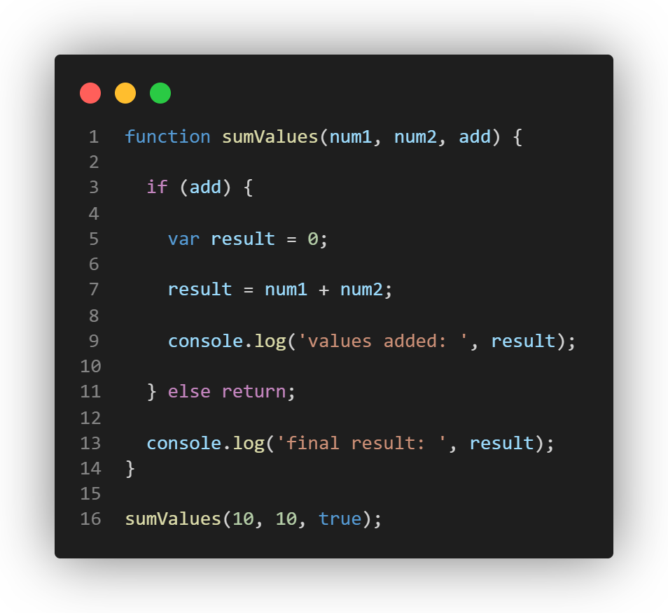

# Part 1. A Quick Introduction...



1. What is printed by line 9? If the code returns an error, explain why. ^^^^^

```
values added: 20
```

2. What is printed by line 13? If the code returns an error, explain why.

```
final result: 20
```
> Declaring `result` using `var` causes it to have function scope, so it is accessible anywhere inside the `sumValues` function.

3. Why should you **not use** var? Explain why.

> You should **not use** `var` because it has function scope or global scope (if a variable is declared using `var` outside a function), which can cause unexpected behavior in the code. This may cause a variable to be accessible somewhere it should not be. `var` declarations are also hoisted to the top of their scope and initialized with `undefined`, which can lead to other unexpected behaviors.


4. What is printed by line 9? If the code returns an error, explain why. ^^^^^

```
values added: 20
```

5. What is printed by line 13? If the code returns an error, explain why.

> The code returns an **error**. Since `let` has block scope, `result` is only accessible inside the `if` block it was declared in. Since line 13 is outside of the `if` block, trying to access `result` with return an error.
