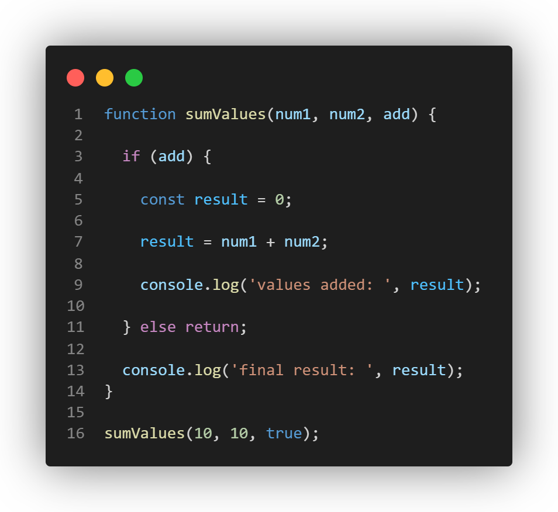

# Part 1. A Quick Introduction...

For this section (questions 1-7), observe the effect that the keywords *const*, *var*, and *let* have on the sumValues() function and those differences are caused by their differing variable scopes.

**var declaration - AVOID USING VAR WHENEVER POSSIBLE**

THe var keyword USED TO provide its variable with what is known as **function scope**. This means that regardless of the block it is defined in, it can be accessed anywhere inside the function it is defined in. In the past, using var to declare your variables in your programs led to naming conflicts and scoping issues.


1. What is printed by line 9? If the code returns an error, explain why. ^^^^^

```
values added: 20
```

2. What is printed by line 13? If the code returns an error, explain why.

```
final result: 20
```
> Declaring `result` using `var` causes it to have function scope, so it is accessible anywhere inside the `sumValues` function.

3. Why should you **not use** var? Explain why.

> You should **not use** `var` because it has function scope or global scope (if a variable is declared using `var` outside a function), which can cause unexpected behavior in the code. This may cause a variable to be accessible somewhere it should not be. `var` declarations are also hoisted to the top of their scope and initialized with `undefined`, which can lead to other unexpected behaviors.


4. What is printed by line 9? If the code returns an error, explain why. ^^^^^

```
values added: 20
```

5. What is printed by line 13? If the code returns an error, explain why.

> The code returns an **error**. Since `let` has block scope, `result` is only accessible inside the `if` block it was declared in. Since line 13 is outside of the `if` block, trying to access `result` with return an error.

**const declaration**

The const keyword gives its variable the same scope as the let keyword. Declaring a variable with the const prevents it from being reassigned after it is assigned for the first time, much like the final keyword in Java, making it useful for declaring constants in your programs.



6. What is printed by line 9? If the code returns an error, explain why. ^^^^^

> The code returns an **error** before line 9 is reached. `result`, which was declared using `const`, tries to get reassigned in line 7, which is not allowed. This causes the code to return an error and terminate before line 9 is reached.

7. What is printed by line 13? If the code returns an error, explain why.

> The code returns an **error**. From question 6, the code returns an error in line 7 and terminates before line 13 is reached. Even if `result` were not reassigned and line 13 were reached, the code would still return an **error** as `result` was declared using `const` inside the `if` block, so `result` would not be accessible outside of the `if` block, where line 13 is located.