# Part 2. A Little More of a Challenge...

In this next section, use what you understand about the differences between declaring variables with var, let, and const to help you work with a more complicated block of code.

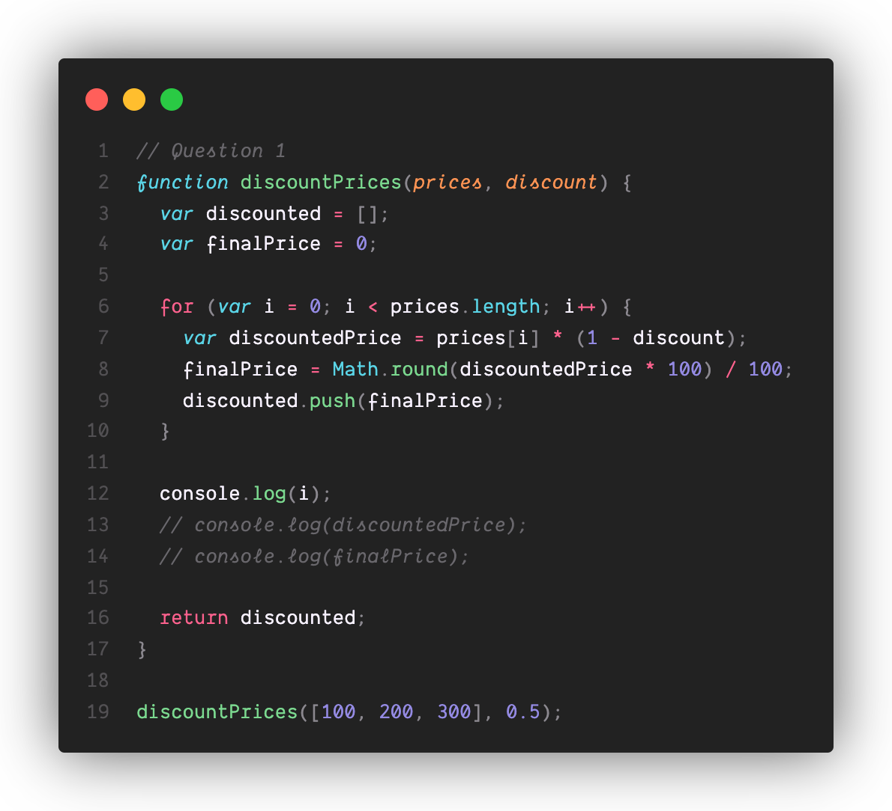

1. ^^^ What will happen at line 12 and why? If the code causes an error, explain why. ^^^

> The code will print

```
3
```
> `i` is function scoped because it was declared using `var`. Therefore, `i` is accessible anywhere inside the `discountPrices` function. The `for` loop runs 3 times, from `i = 0` to `i = 2` for the array `[100, 200, 300]`, which has length 3. After the final iteration of the loop, `i` is incremented from `2` to `3`, which is the value of `i` when the code reaches line 12. Therefore, the code prints `3` at line 12.

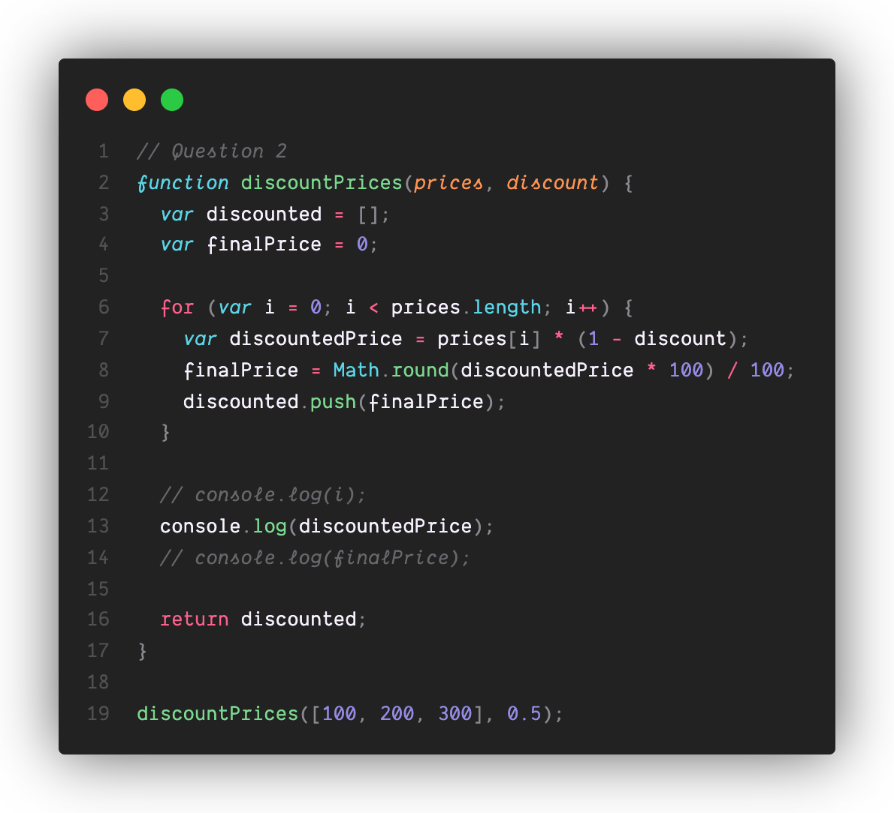

2. ^^^ What will happen at line 13 and why? If the code causes an error, explain why. ^^^

> The code will print

```
150
```

> `discountedPrice` is function scoped because it was declared using `var`. Therefore, `discountedPrice` is accessible anywhere inside the `discountPrices` function. The `for` loop runs 3 times, from `i = 0` to `i = 2` for the array `[100, 200, 300]`, which has length 3. During the final iteration of the loop, when `i = 2`, `discountedPrice` is assigned the value of `prices[i] * (1 - 0.5)`, which is `300 * 0.5 = 150`. After the loop is finished, `discountedPrice` is still accessible with value `150`, so the code will print `150` on line 13.

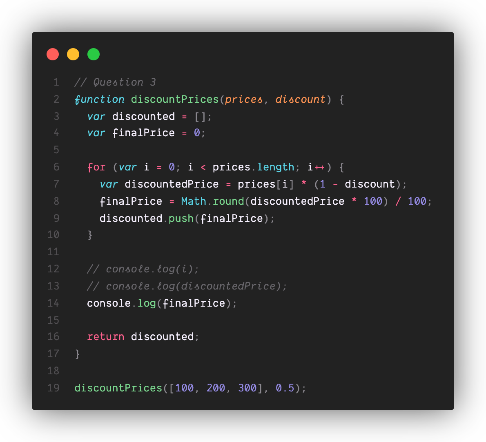

3. ^^^ What will happen at line 14 and why? If the code causes an error, explain why. ^^^

> The code will print

```
150
```

> `finalPrice` is function scoped because it was declared using `var`.  Therefore, `finalPrice` is accessible anywhere inside the `discountPrices` function. From question 2, `discountedPrice` is set to `150` at the beginning of the final iteration of the `for` loop. In this same iteration, `finalPrice` is reassigned to `Math.round(discountedPrice * 100) / 100`, which is `Math.round(150 * 100) / 100 = Math.round(15000) / 100 = 15000 / 100 = 150`. After the loop is finished, `finalPrice` is still accessible with value `150`, so the code will print `150` on line 14.


4. ^^^ What will this function return? Give a brief explanation why. If the code causes an error, explain why.^^^

> The function will return

```
[50, 100, 150]
```

> When `discountPrices` is called with inputs `prices = [100, 200, 300]` and `discount = 0.5`, `discounted` is set to an empty array `[]`. Over the `for` loop, each price in the `prices` array is multiplied by `(1 - discount) = 1 - 0.5 = 0.5` to apply a 50% discount, then rounded and added to the resulting `discounted` array. Therefore, `discounted` will be `[50, 100, 150]` after the loop finishes. The function then returns `discounted`, which is `[50, 100, 150]`.

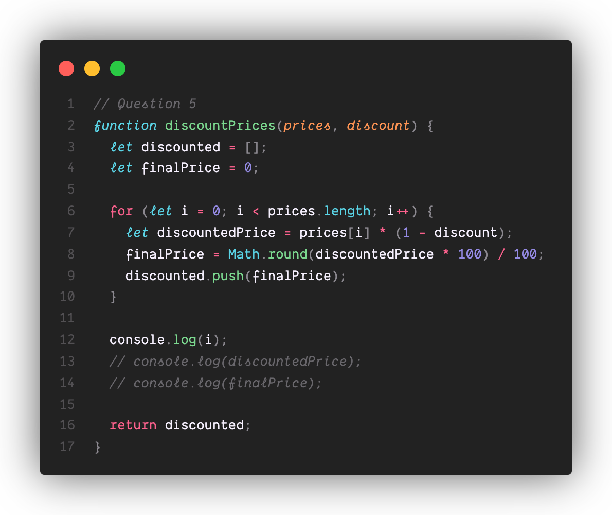

5. ^^^ What will happen at line 12 and why? If the code causes an error, explain why. ^^^ (assume this function is being called like the others: discountPrices([100, 200, 300], 0.5)).

> The code will cause an **error**. The variable `i` is declared using `let` inside the `for` loop, so it is scoped to the loop block. Therefore, `i` is not accessible outside of the loop. When line 12 is reached, `i` is no longer defined, and the code will throw an error.


6. ^^^ What will happen at line 13 and why? If the code causes an error, explain why. ^^^

> The code will cause an **error**. The variable `discountedPrice` is declared using `let` inside the `for` loop, so it is scoped to the loop block. Therefore, `discountedPrice` is not accessible outside of the loop. When line 13 is reached, `discountedPrice` is no longer defined, and the code will throw an error.

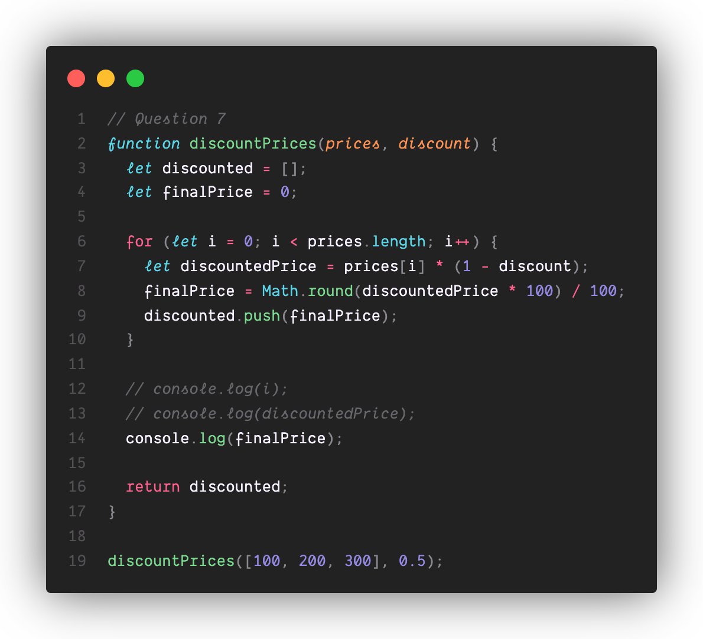

7. ^^^ What will happen at line 14 and why? If the code causes an error, explain why. ^^^

> The code will print

```
150
```

> `finalPrice` is declared at the beginning of the function using `let`, outside of any inner blocks, so it has function scope (i.e. accessible throughout the entire function). It gets updated during each iteration of the `for` loop. During the third (and final) iteration of the `for` loop (since `[100, 200, 300].length = 3` and hence `i = 2`), `finalPrice` is reassigned to `Math.round(discountedPrice * 100) / 100 = Math.round(150 * 100) / 100 = Math.round(15000) / 100 = 15000 / 100 = 150`. After the loop is finished, `finalPrice` is still accessible with value `150`, so the code will print `150` on line 14.

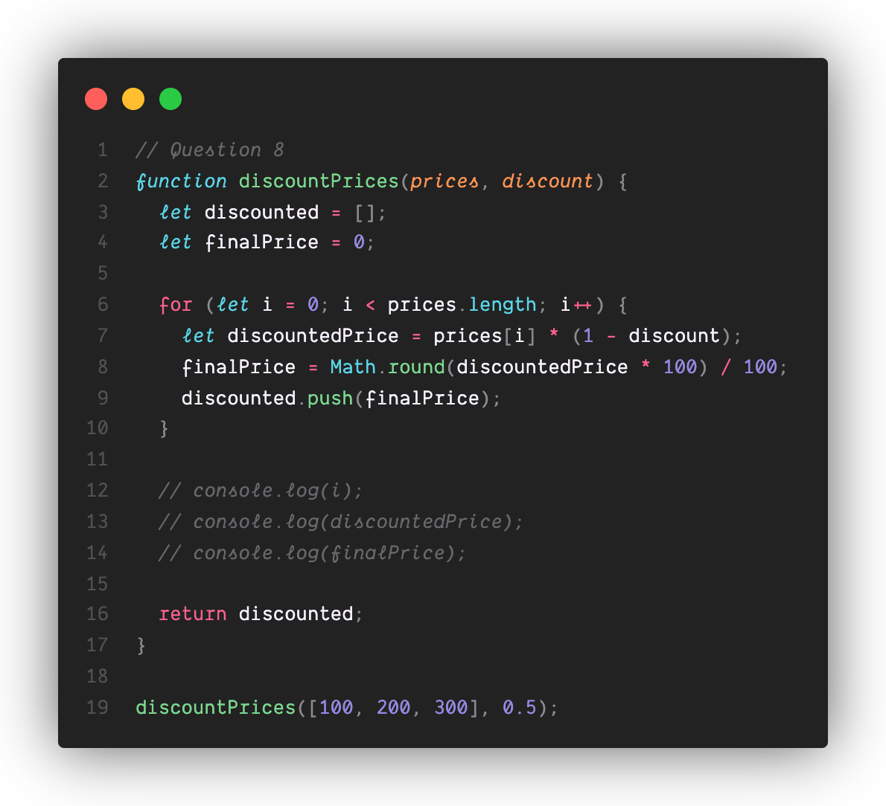

8. ^^^ What will this function return? Give a brief explanation/ If the code causes an error, explain why. ^^^

> The function will return

```
[50, 100, 150]
```

> When `discountPrices` is called with inputs `prices = [100, 200, 300]` and `discount = 0.5`, `discounted` is set to an empty array `[]`, using `let`, so it is has function scope. Over the `for` loop, each price in the `prices` array is multiplied by `(1 - discount) = 1 - 0.5 = 0.5` to apply a 50% discount, then rounded and added to the resulting `discounted` array. Therefore, `discounted` will be `[50, 100, 150]` after the loop finished. Since `discounted` is declared using `let`, it is accessible throughout the entire function, particularly at line 16, where the function returns `discounted`, which is `[50, 100, 150]`.

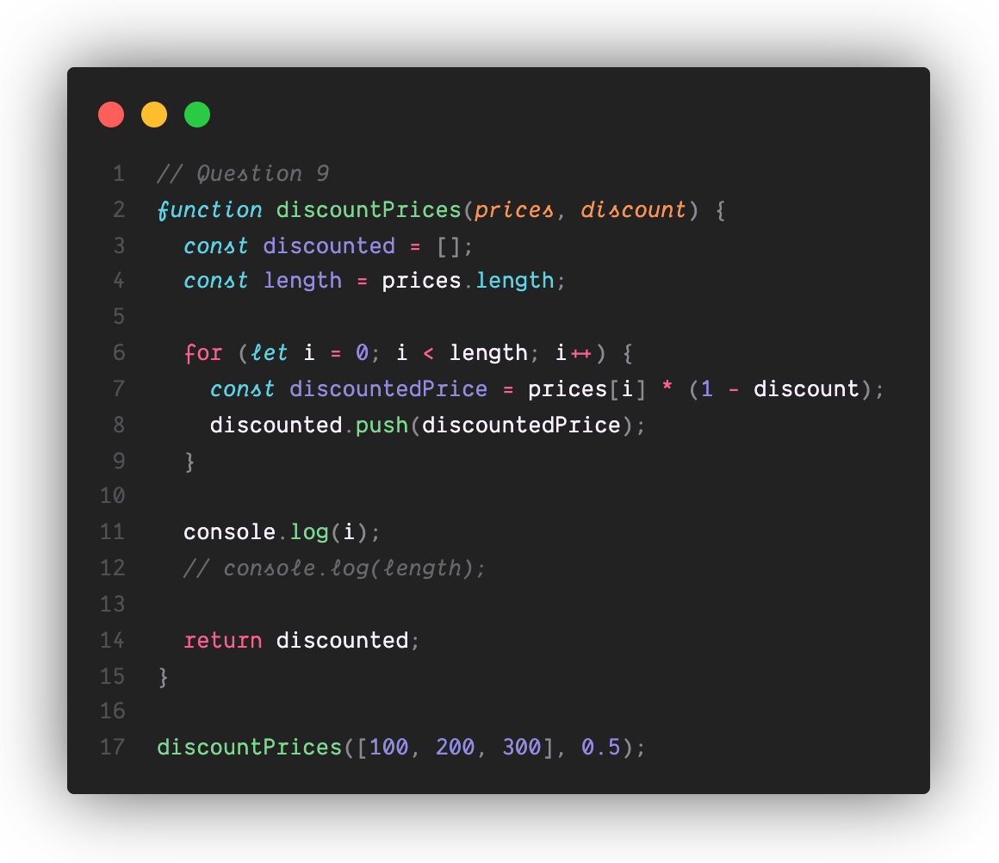

9. ^^^ What will happen at line 11 and why? If the code causes an error, explain why. ^^^

> The code will cause an **error**. The variable `i` is declared using `let` inside the `for` loop, so it is scoped to the loop block. Therefore, `i` is only accessible inside the loop and not outside of it. When line 11 is reached, `i` is no longer defined, and the code will throw an error.

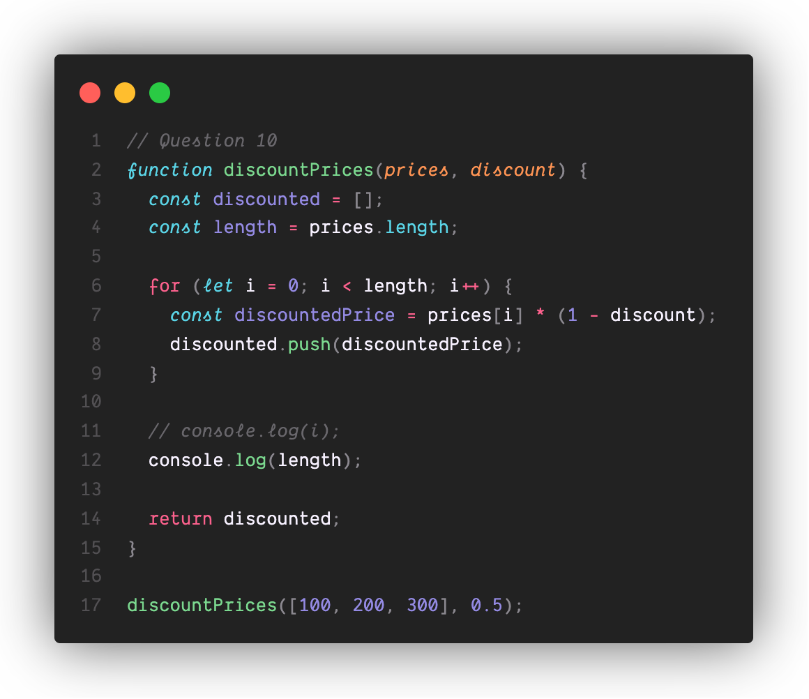

10. ^^^ What will happen at line 12 and why? If the code causes an error, explain why. ^^^

> The code will print

```
3
```

> When `discountPrices` is called with inputs `prices = [100, 200, 300]` and `discount = 0.5`, `length` is set to `prices.length`, which is `3`, using `const`. Since `length` is declared using `const` outside of the `for` loop, it is function scoped and accessible throughout the entire function. The `for` loop does not attempt to reassign `length`, so no errors will be thrown. When line 12 is reached, `length` is still accessible with value `3`, so the code will print `3`.

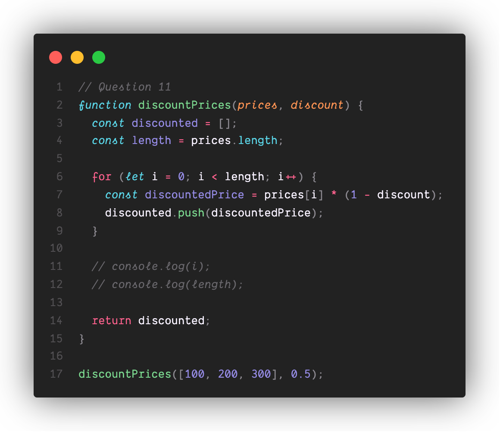

11.  ^^^ What will this function return? Give a brief explanation. If the code causes an error, explain why. ^^^

> The function returns

```
[50, 100, 150]
```

> When `discountPrices` is called with inputs `prices = [100, 200, 300]` and `discount = 0.5`, `discounted` is set to an empty array `[]` using `const`. Over the `for` loop, each price in `prices` is discounted by 50% and added to the `discounted` array. So, at the end of the loop, `discounted` will be `[50 100, 150]`. Note that `discounted` was initially declared using `const`, but it is not reassigned at any point in the function. The code in the `for` loop only mutates the `discounted` array by adding new elements to it, which will not throw an error. Therefore, the function will return `discounted`, which is `[50, 100, 150]`.

## Data Types

There are 9 data types in JavaScript. Unlike in other languages, JavaScript lets you assign any data type to any variable at any time, since variables aren't initialized as a single type.

Primitive data types in JavaScript behave the same as most other languages, the tricky part with them will be conversions and comparisons which we will get to in the next section. Here, we're going to focus on Objects. If you have seen JSON (JavaScript Object Notation), before, then you are familiar with their format.

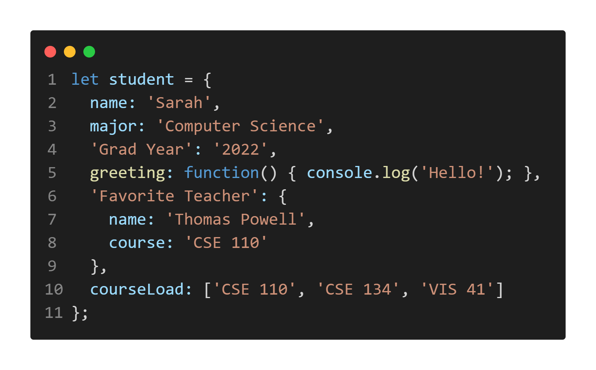

12. Given the above Object, write the notation for:

    A. Accessing the value of the name property in the student object

        student.name
    
    B. Accessing the value of the Grad Year property in the student object

        student['Grad Year']

    C. Calling the function for the greeting property in the student object

        student.greeting()

    D. Accessing the name property of the object in the Favorite Teacher property in student

        student['Favorite Teacher'].name


    E. Access index zero in the array of the courseLoad property of the student object

        student.courseLoad[0]

## Basic Operators & Type Conversion

One of the key parts of JavaScript is its weak typing, meaning that a single variable can take multiple data types (i.e. a variable initially declared as a string can legally be reassigned to an integer). Because of this, JavaScript is also designed to be able to compute operations between variables of different data types meaning we can do things like adding a string and an int (what?).

JavaScript is able to do this because it is able to map the value of a variable from oen data type to another. For example,

* true + 10 = 11 since true maps to 1
* 3 + '5' = '35' since integers map to their exact string representation
* 'hi there' + {} = 'hi there [object Object]' since objects map to the string '[object Object]'
* ...and there are many more examples

While this is one of its greatest strengths, it can cause a lot of confusion for developers who don't fully understand how types are converted. However, what we can rely on is the fact that the conversions between data types are consistent and can be looked up on the internet easily.

What is important is the understanding that type conversions occur automatically and without warning which can help you identify strange bugs or create helpful shortcuts.

For each of the following questions, note down the output as well as a brief explanation why that output was given

13. Arithemtic
    
    A. '3' + 2

    > The output will be the string `'32'`. `+` is the string concatenation operator when there is at least one string. Integers map to their exact string representation, so the integer `2` is converted to the string `'2'` and concatenated with the string `'3'`, resulting in `'32'`.

    B. '3' - 2

    > The output is the integer `1`. `-` is the subtraction operation, which only works with numbers. The string `'3'` is converted to the integer `3`, and is subtracted by `2`, resulting in `1`.

    C. 3 + null

    > The output is the integer `3`. `null` is converted to the integer `0`, so we have `3 + 0 = 3`.

    D. '3' + null

    > The output is the string `'3null'`. `null` is converted to the string `'null'` and concatenated with the string `'3'`, so the output is `'3null'`.

    E. true + 3

    > The output is the integer `4`. `true` is converted to the integer `1`, so we have `1 + 3 = 4`.

    F. false + null

    > The output is the integer `0`. `false` and `null` are both converted to the integer `0`, so we have `0 + 0 = 0`.

    G. '3' + undefined

    > The output is the string `'3undefined'`. `undefined` is converted to the string `'undefined'` and is concatenated with the string `'3'`, so the output is `'3undefined'`.

    H. '3' - undefined

    > The output is `NaN`. While `'3'` can be converted to the integer `3`, `undefined` cannot be converted to a number, so the result is `NaN` (Not a Number).

14. Comparison
    
    A. '2' > 1

    > The output is `true`. The string `'2'` is converted to the integer `2`, and `2 > 1` is `true`.

    B. '2' < '12'

    > The output is `false`. The strings `'2'` and `'12'` are compared lexicographically. Since the first character of `'2'`, namely `'2'`, is greater (lexicographically) than the first character of `'12'`, namely `'1'`, the output is `false`.

    C. 2 == '2'

    > The output is `true`. The `==` operator does type coercion, so the string `'2'` is converted to the integer `2`, and `2 == 2` is `true`.

    D. 2 === '2'

    > The output is `false`. The `===` operator checks for both value and type. Since `2` is an integer and `'2'` is a string, the output is `false`.

    E. true == 2

    > The output is `false`. `true` is converted to the integer `1`, and `1 == 2` is `false`.

    F. true === Boolean(2)

    > The output is `true`. `Boolean(2)` evaluates to `true` (since any non-zero number is truthy), and `true === true` is `true`.

15. Explain the difference between the `==` and `===` operators.

> The `==` operator compares the values of two data types after type coercion (if neccessary). However, the `===` operator compares both the values and the types of the two data types (without type coercion).


## Loops

Loops in JavaScript are nothing fancy, the format for for, while, and do while being identical to most every programming language (the only difference being the fact you create your iterating variable with a JS keyword, typically let). There is one other JS specific type of loop that can be handy to know, the for...in loop. This will let you iterate over every property inside of an Object (much like the for...in loop used in Python).

16. Given the above Object, write a for...in loop that will iterate through it and print out the value of the property if the property starts with the letter r, or if the value of that property is an odd number.

> Refer to `part2-question16.js`.

## Functions

Like most programming languages, JavaScript has functions, simply written with the keyword "function". As seen above in the Data Types section, a function is also 1 of the 9 data types and can thus be stored in a variable and easily passed around like any other variable. Since functions can be stored in a variable, we can call the function using that variable at a later time in your program.

This allows for one to return a function as a value, allowing these functions to be "called back to" at a later time (which can help if things are happening asynchronously, such as if you are awaiting a response from a server).

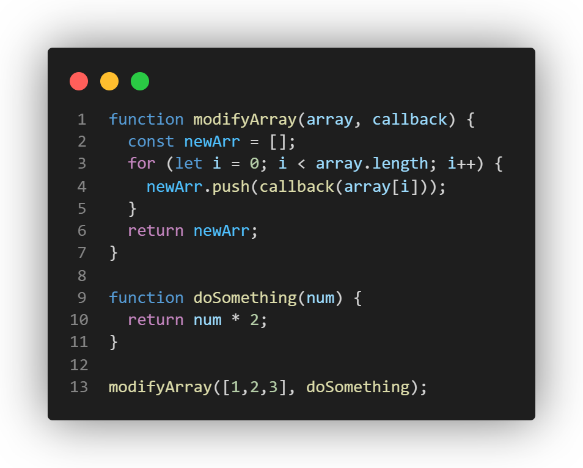

17.  If the function above is called with the following parameters **modifyArray([1,2,3], doSomething)**, what will be the result? Briefly walk through how you arrived at that result. Here we are passing in a function as a parameter, however we can also return a function from another function just as easily, you're encouraged to play around with callbacks as they are used heavily in frontend JS development.

> The result of calling `modifyArray([1, 2, 3], doSomething)` is

```
[2, 4, 6]
```

> When `modifyArray` is called with inputs `array = [1, 2, 3]` and `callback = doSomething`, the function loops through each element of `array` and applies `doSomething` to each element. The `doSomething` function takes an integer and returns that integer multiplied by `2`. In the first iteration, `doSomething` is called on `array[0]`, which is `1`, and returns `2`. `2` is then pushed to `newArr`. In the second iteration, `doSomething` is called on `array[1]`, which is `2`, and returns `4`. `4` is then pushed to `newArr`. In the third iteration, `doSomething` is called on `array[2]`, which is `3`, and returns `6`. `6` is then pushed to `newArr`. After we complete the loop, we return `newArr`, which is `[2, 4, 6]`.

## setInterval(), setTimeout(), clearInterval()

Since a lot of JavaScript will be running in real time while the user is on a webpage, you'll probably run into situations where you need some code to execute at consistent intervals, or once after a set period of time. That's where setTimeout(), setInterval(), and clearTimeout() come into play.

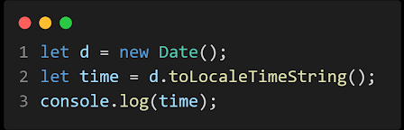

18. The above program only prints out the time once when executed. Modify this code such that the program prints out the *current* time every second.

> Refer to `part2-question18.js`.

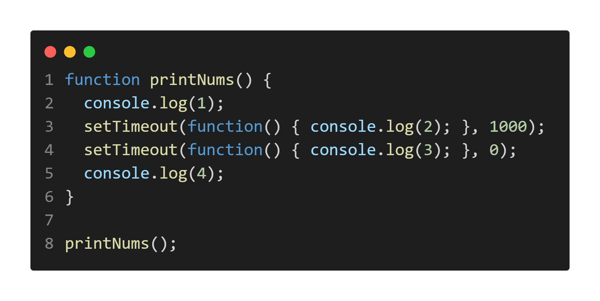

19. What is the output of the above code?

> The output of the above code is

```
1
4
3
2
```

> When `printNums` is called, `console.log(1)` runs immediately, printing `1`. Then, `setTimeout` is called to run `console.log(2)` `1000` milliseconds (1 second) after the main thread is finished. Then, `setTimeout` is called again to run `console.log(3)` `0` milliseconds after the main thread is finished. Then, `console.log(4)` runs immediately, printing `4`. Now, that the main thread is finished, we go to the event queue. Since `console.log(3)` was set to run `0` milliseconds after the main thread was finished, it runs next, printing `3`. Finally, after `1000` milliseconds, `console.log(2)` runs, printing `2`. Thereforem the final output is `1 4 3 2`, where each number is printed on a new line.

